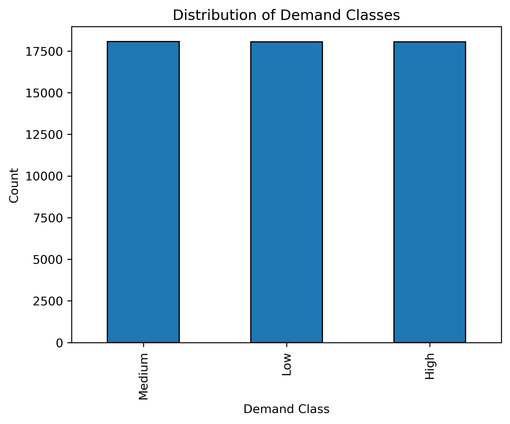
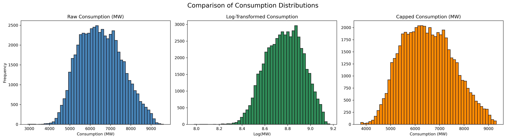
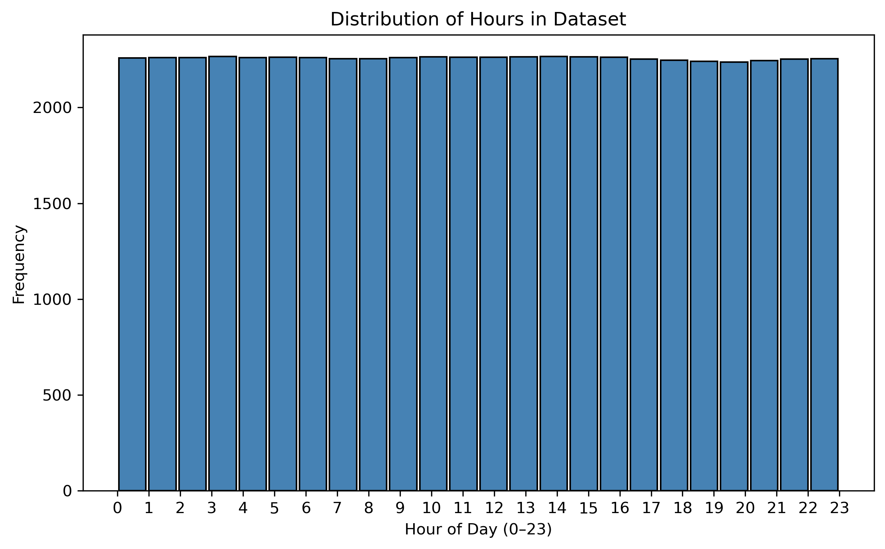
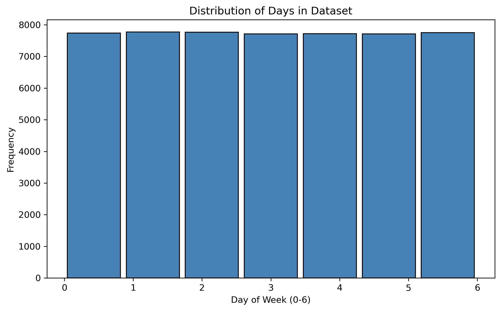
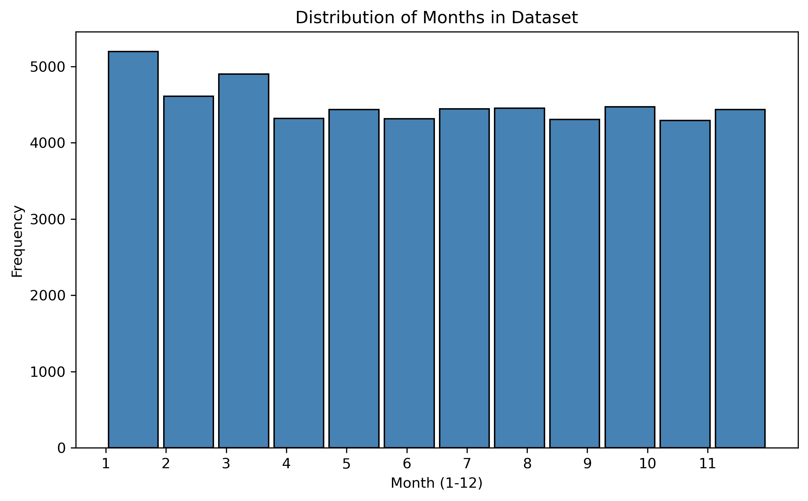
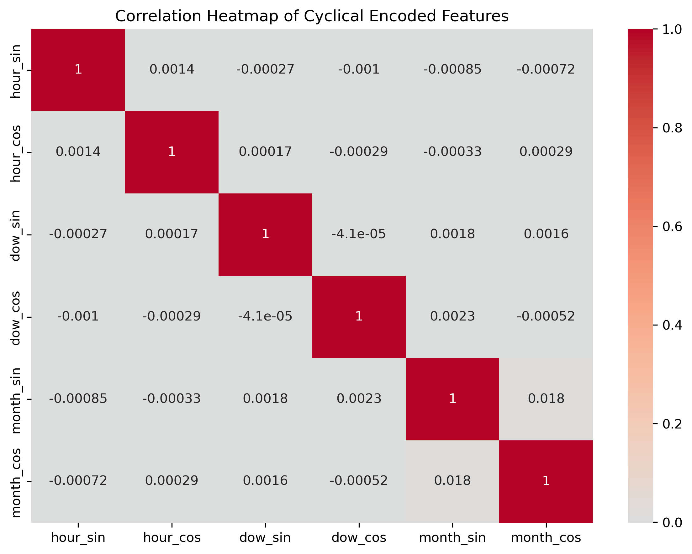
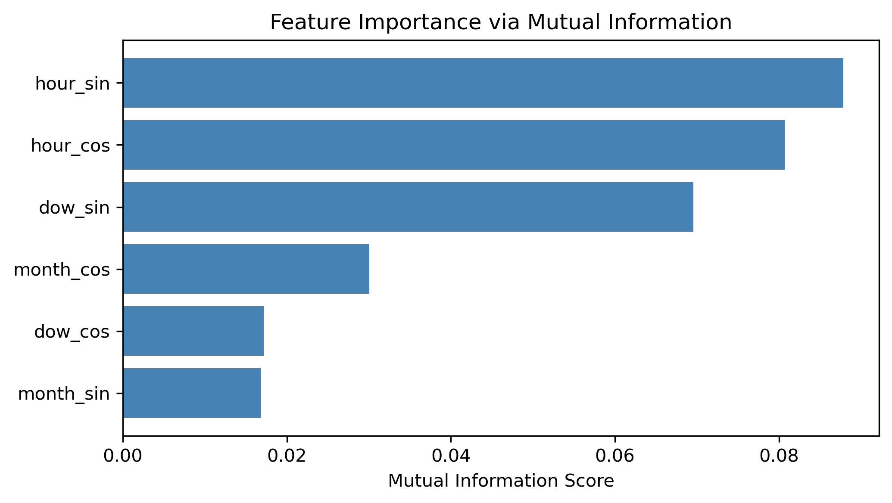
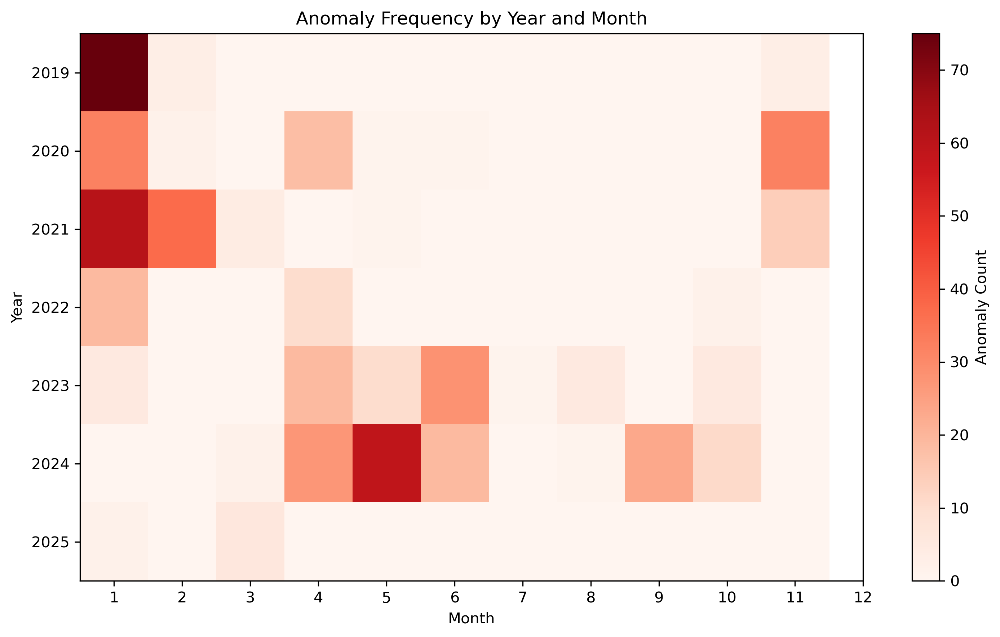

# Exploratory Data Analysis Report – Electricity Demand Classification

## Executive Summary
The dataset contains ~54,000 hourly electricity consumption records for Romania, spanning multiple years. 
Overall, the data is **complete, balanced, and suitable for modeling**. 
The target classes (Low/Medium/High demand tiers) are well-distributed due to quantile binning, and key temporal features (hour, day of week, month) show strong associations with demand class. 
Some anomalies (extreme peaks and dips) were identified but appear consistent with seasonal patterns and rare events. 
The dataset is ready for predictive modeling with minimal further cleaning required.

---

## Data Provenance
- **Source:** Romanian electricity consumption and production dataset (hourly records).  
- **Version:** Preprocessed dataset (`02_data.csv`) derived from raw CSV.  
- **License:** Open dataset; no explicit restrictions beyond attribution.  
- **Access:** Freely available; internal preprocessed versions saved under `data/processed/`.  

---

## Class Distribution
- Classes (Low, Medium, High) created via quantile binning of capped consumption.  
- Each class contains roughly one-third of the samples (~18k).  

**Visualization: Demand Class Distribution**

---

## Variable Summaries
- **Consumption:** Right-skewed originally, stabilized with capping. Seasonal peaks observed.  
- **Hour of Day:** Uniform coverage across all 24 hours. Demand peaks align with morning and evening.  
- **Day of Week:** All 7 days present; weekdays show slightly higher demand.  
- **Month:** All 12 months represented, with higher averages in winter.  

**Visualizations:**
- Histogram of capped consumption

- Histogram of hour

- Histogram of day of week

- Histogram of month

---

## Key Correlations & Feature Insights
- **Chi-Square tests**: Strong associations between demand class and hour, day of week, month.  
- **Mutual Information**: Hour features most predictive, followed by day of week; month features weaker.  
- **Correlation Heatmap**: No spurious correlations across cyclical encodings; redundancy only within sine/cosine pairs.  

**Visualizations:**
- Correlation heatmap

- Mutual information scores

---

## Missing Values & Outliers
- No missing values detected in consumption or features.  
- Outliers present in raw consumption (extreme peaks/dips).  
- Strategy: Winsorization applied at 0.05%/99.95% thresholds → `Consumption_capped`.  
- Anomaly detection flagged rare high winter peaks and recent low dips; most appear valid rare events, but sustained low anomalies in recent years may require further investigation.  

**Visualizations:**
- Consumption timeline with anomalies

- Heatmap of anomaly frequency by year/month

---

## Ethical & Licensing Notes
- **Ethical Use:** Dataset reflects aggregated grid demand, not personal data; no privacy concerns.  
- **Limitations:** Rare events (e.g., holidays, crises) may disproportionately affect anomalies. Care should be taken when generalizing results across different years or regions.  
- **Licensing:** Assumed open for academic/educational use. Attribution recommended.  

---

## Next-Step Recommendations
1. **Feature Engineering**  
   - Add lag features (previous hour/day consumption classes).  
   - Explore interaction terms between hour/day/month.  
2. **Dimensionality Reduction**  
   - Test PCA or embeddings to compress sine/cosine pairs while monitoring interpretability.  
3. **Anomaly Review**  
   - Further investigate sustained low anomalies in recent years.  
   - Decide whether to treat them as valid structural changes or noise.  
4. **Model Preparation**  
   - Use stratified splits (already prepared).  
   - Begin with tree-based classifiers and compare with simpler baselines.  