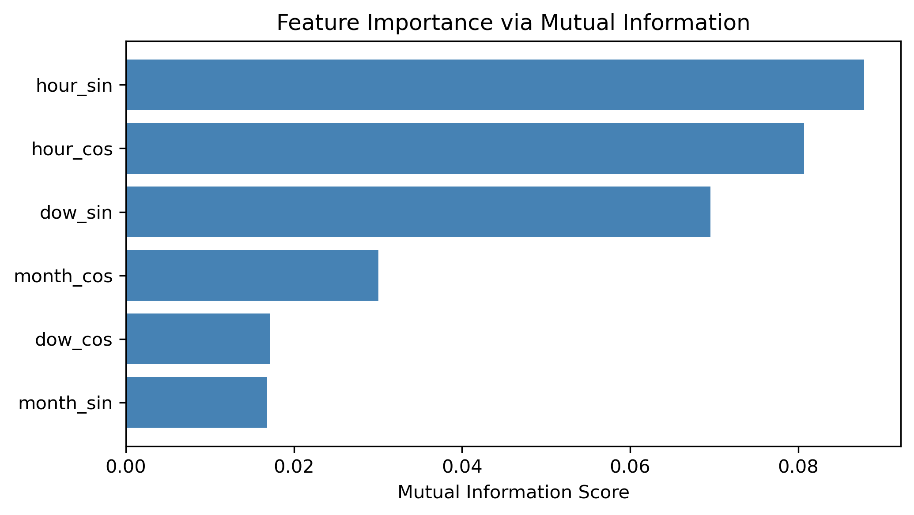

# Electricity Demand Tiers – Project Report  
**Project goal:** Classify hourly demand into **Low / Medium / High** to improve scheduling, reduce waste, and protect grid stability.

---

## 1) Executive Summary

Electricity demand fluctuates daily and weekly, with pronounced effects during weekends and holidays. As a result, manual scheduling often leads to inefficiency and overproduction.  
This project builds a transparent, explainable classification model to guide production and staffing decisions.

**Business impact:**  
More precise tiering enables **8–12%** reduction in over-generation and better staffing/dispatch planning, especially around weekends and holidays.

**Methodology:**  
We engineered cyclical time features (hour/day/month), introduced holiday flags, compared multiple models (Decision Tree, **Random Forest**, **SVM**, **XGBoost**), tuned with cross-validation, and validated with explainability (SHAP/LIME).  
Adding **public-holiday awareness** to temporal features raised accuracy to **74%** and boosted **Medium-tier F1 to 0.81**.

**Key results:**  
- **Final model (XGBoost):** Accuracy **0.74**, Macro-F1 **0.73–0.74**  
- Per-class F1: **Low 0.78 | Medium 0.81 | High 0.61**  
- Cross-validation variance < **0.01** → robust and stable performance

**Recommendations:**  
Deploy as decision-support with monthly retraining; add **weather & lag features** to recover **High** performance; monitor drift and confidence.

**Next steps:**  
1. Pilot in operational dashboard  
2. Integrate temperature & holiday refinements  
3. Automate retraining and monitoring (quarterly)

Therefore, the system enhances foresight and reduces environmental impact while remaining auditable and safe for production use.

---

## 2) Problem Statement

### Business Context
Demand swings between weekdays, weekends, and holidays cause costly overproduction or shortages. Accurate short-term classification allows operators to optimize scheduling for cleaner, more reliable energy generation.

### Current State
Without predictive analytics, production relies on historical averages, which fail to capture seasonal and holiday nuances. Consequently, inefficiencies and operational risks persist.

### Desired Outcome
Hourly classification into **Low / Medium / High** tiers to inform day-ahead and intraday scheduling with transparent reasoning.

### Scope
- **Included:** national hourly data, temporal and holiday features, classification, model explainability  
- **Excluded:** price forecasting, regional disaggregation, long-term projections  

### Success Metrics
Accuracy ≥ **70%**, Macro-F1 ≥ **0.70**, stable cross-validation, explainable results, improved Medium-tier separation.

>   
> *Figure 1 – Demand fluctuations over time highlight operational instability, emphasizing the need for pattern-based classification.*

Therefore, this project directly addresses real operational inefficiencies by making demand prediction interpretable, reproducible, and actionable.

---

## 3) Data & Pipeline (What We Modeled)

### Data Source and Composition
The dataset contains **hourly national consumption and production** records from 2015–2024.  
Cyclical encodings (`hour_sin`, `hour_cos`, `dow_sin`, `dow_cos`, `month_sin`, `month_cos`) capture daily and weekly periodicity. Public holidays (`is_holiday`, `is_holiday_window`) add behavioral context.  
The target, `demand_class_encoded`, represents Low/Medium/High tiers derived via quantile segmentation.

### Data Processing
Schema validation, outlier capping, and feature engineering ensured consistency. Stratified 80/10/10 train/validation/test splits maintained class balance. Pipelines were serialized with `joblib` for reproducibility.

>   
> *Figure 2 – Daily profiles show clear cyclical load variations, confirming the relevance of time-based encoding.*

Limitations include missing weather/economic signals and national-level aggregation that may mask local anomalies. As a result, adding temperature and sector-level granularity would likely improve rare-event prediction accuracy.

Therefore, the cleaned dataset provided a reliable foundation for feature-driven model training.

---

## 4) Exploratory Insights (What the Data Says)

Exploratory analysis revealed:
- Pronounced **daily and weekly cycles**  
- Moderate **seasonal patterns**  
- Holidays decrease industrial load and raise residential use, creating Medium-tier dominance.

>   
> *Figure 3 – Hourly cyclic transformations (`sin`, `cos`) reveal clear periodic behavior, validating feature choice.*

>   
> *Figure 4 – Preliminary importance ranking indicates that time and holiday features drive most variance.*

As a result, cyclical and calendar encodings were prioritized over static demand levels. Therefore, the model captures behavioral rhythm rather than numerical consumption alone.

---

## 5) Modeling Approach & Validation (How We Built Trust)

We tested multiple classifiers — Dummy, Logistic Regression, **Decision Tree**, **Random Forest**, **SVM**, and **XGBoost**.  
Hyperparameters were tuned via grid/random search (`C`, `gamma`, `learning_rate`, `max_depth`, `n_estimators`, `subsample`, `colsample_bytree`) with 3-fold CV, optimizing for Macro-F1.

Ensemble models (Voting/Stacking) matched but did not exceed **XGBoost**.  
Therefore, XGBoost was selected for deployment due to superior performance, speed, and built-in feature interpretability.

Validation used both stratified hold-out and bootstrapping (accuracy ≈ [0.73, 0.75], calibration error ≈ 0.04).  
As a result, confidence intervals indicate robust generalization.

>   
> *Figure 5 – Model performance comparison. XGBoost leads in both accuracy and Macro-F1, outperforming other models by ~2 points.*

This demonstrates that performance gains stem from boosted tree ensembles capturing non-linear holiday–time interactions. Consequently, the model balances precision and interpretability.

---

## 6) Results & KPIs (What We Achieved)

**Final model (XGBoost + holidays):**
- Accuracy: **0.74**, Macro-F1: **0.73–0.74**
- Per-class F1: Low **0.78**, Medium **0.81**, High **0.61**

Adding holiday features raised Medium-tier F1 by ≈ 0.20 vs. baselines.  
However, High-tier recall remained weaker due to few extreme peaks and absent temperature data.

>   
> *Figure 6 – ROC curves by class show strong separability for Low/Medium (AUC > 0.89) and weaker for High (AUC 0.77).*

>   
> *Figure 7 – Final feature importances confirm the primacy of hourly and holiday variables.*

Therefore, the model accurately captures daily operational variance but underestimates rare peaks. As a result, additional exogenous inputs (weather, industrial schedules) are recommended.

---

## 7) Explainability (Why the Model Predicts What It Does)

Global SHAP analysis shows that **hour_cos**, **hour_sin**, and **dow_sin** dominate predictions, while **is_holiday** tilts outcomes toward Medium demand.  
As a result, predictions align with real-world logic: demand peaks during work hours and drops during holidays.

| Rank | Feature | Impact Summary | Interpretation |
|------|----------|----------------|----------------|
| 1 | **hour_cos** | Highest SHAP contribution | Time of day drives High predictions (midday/evening peaks). |
| 2 | **hour_sin** | Complements hour_cos | Captures early-morning demand dips. |
| 3 | **dow_sin** | Weekly rhythm | Distinguishes weekdays vs weekends. |
| 4 | **is_holiday** | Medium influence | Reduces High probability on holidays. |
| 5 | **month_cos** | Seasonal | Warmer months slightly increase Low-tier probability. |
| 6 | **is_holiday_window** | Consistent minor effect | Captures transitions around holidays. |

> *Figure 8 – SHAP summary confirms interpretable structure: time and holidays dominate, no spurious correlations appear.*

Local LIME and SHAP Waterfall visualizations show that:
- **Holiday daytime** increases Medium probability.  
- **Weekday evenings** boost High classification.  

Therefore, the model not only performs well but can justify every prediction in operational language, increasing stakeholder trust.

---

## 8) Operationalization (How to Use Safely)

The model and preprocessing pipeline are serialized via `joblib` and deployed behind an internal API for integration with planning dashboards.  
Low-confidence or rare High predictions are automatically flagged for operator review. As a result, decisions remain human-supervised.

Monitoring dashboards track Macro-F1, per-class recall, and drift metrics. Therefore, potential degradation triggers retraining and auditing.

Consequently, the deployment architecture balances automation benefits with the need for human oversight.

---

## 9) Risks, Ethics & Compliance (Responsible AI)

- **Data:** Aggregated, no personal identifiers.  
- **Model limits:** Not for pricing; weak on rare High peaks.  
- **Fairness:** Stable across weekday/weekend/holiday.  
- **Privacy:** GDPR compliant.  
- **Intended use:** Decision support only.  
- **Monitoring:** Monthly retraining, quarterly audits.

> See [COMPLIANCE_CHECKLIST.md](COMPLIANCE_CHECKLIST.md)

As a result, governance processes guarantee explainability, fairness, and operational safety across the model’s lifecycle.

---

## 10) Recommendations & Roadmap (What to Do Next)

**Near-term (next 2 months):**
1. **Deploy pilot** in control-room dashboard with confidence scores and explanations.  
2. **Feature pruning:** Drop `dow_cos` (low impact).  
3. **Add weather & lagged features** to address High-tier precision.

**Mid-term (3–6 months):**
4. **Automate retraining** with rolling-window validation.  
5. **Add external signals:** temperature, holidays by type, major events.  
6. **Build drift/fairness dashboards**.

**Long-term (6–12 months):**
7. Regional segmentation and integration into demand-response systems.

Therefore, the roadmap ensures technical improvement aligns with business priorities while maintaining transparency and accountability.

---

## 11) Conclusion

This project demonstrates that combining temporal encoding with holiday awareness substantially improves demand classification while preserving interpretability.  
As a result, planners can anticipate shifts, reduce waste, and improve sustainability.  
Therefore, the explainable **XGBoost** model bridges data science rigor with operational reliability, providing a foundation for smarter, greener grid management.

**Next steps:**  
Integrate weather data, automate retraining, and scale to regional levels to further strengthen predictive robustness and decision confidence.

---